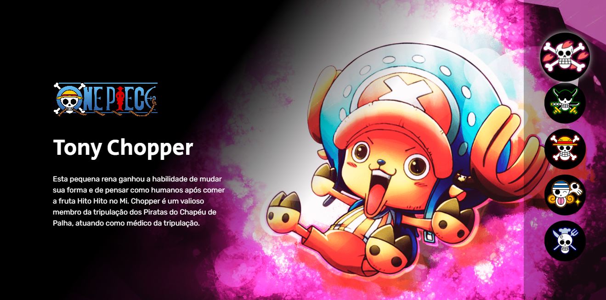
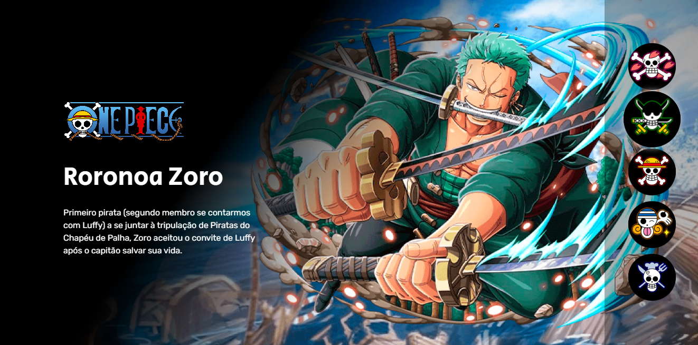
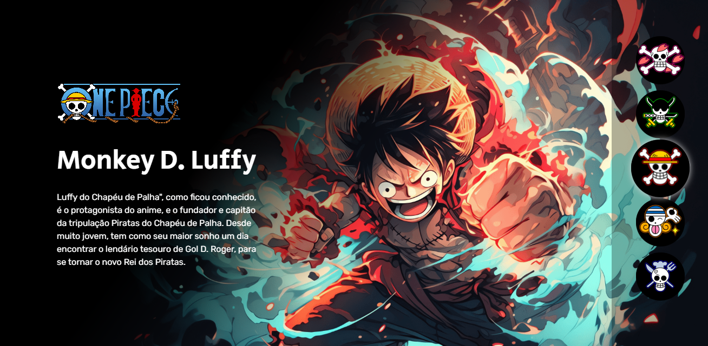
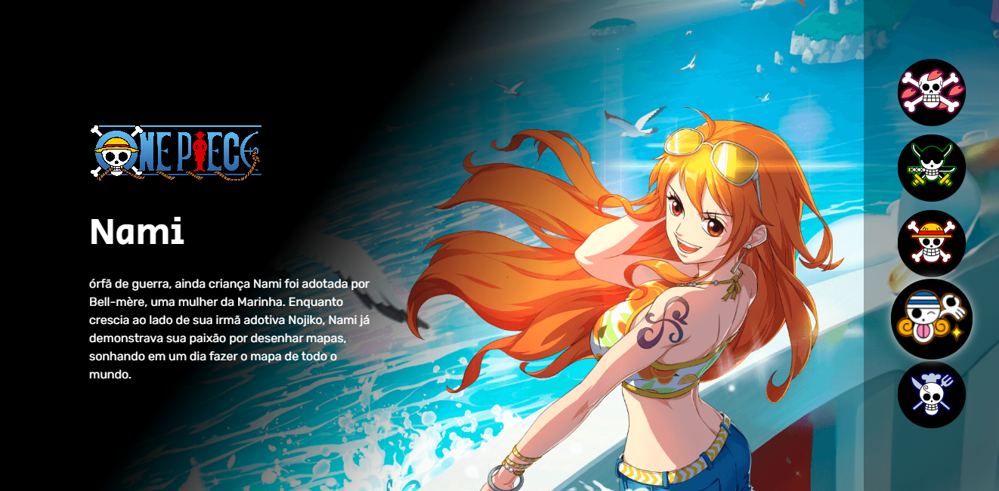
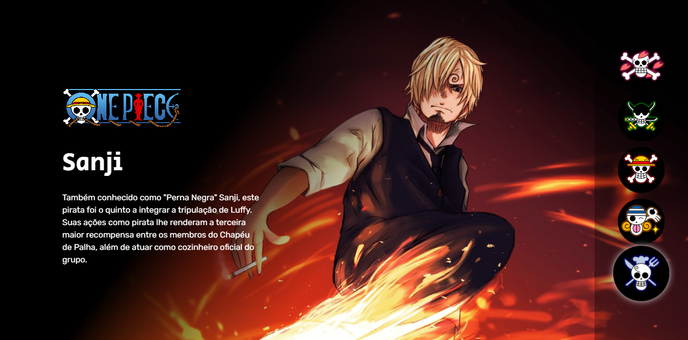

<h1 align="center"> Projeto One Piece</h1>

  

<h1 align="center">O ONE PIECE EXISTE!!!</h1>

Projeto dedicado aos fãs de One Piece! Este repositório contém informações sobre os principais personagens dos Piratas do Chapéu de Palha e seus respectivos papéis na obra.

## Visão Geral

Este projeto foi criado com o auxilio do canal [dev em dobro](https://www.youtube.com/@DevemDobro) para apresentar detalhes e curiosidades sobre os membros dos Piratas do Chapéu de Palha, uma das tripulações mais famosas do anime e mangá One Piece.

## Status do projeto

 
⚠️🚧Em desenvolvimento🚧⚠️

## Conteúdo

- [Chopper🦌](#tony-chopper)
- [Zoro⚔️](#roronoa-zoro%EF%B8%8F)
- [Luffy🍖](#monkey-d-luffy)
- [Nami🍊](#nami)
- [Sanji🔥](#sanji)

⚠️🚧Em desenvolvimento🚧⚠️
- Usopp🤥
- Robin🌸
- Franky🤖
- Brook💀
- Jinbe🦈

## Personagens

### Tony Chopper🦌

#### Esta pequena rena ganhou a habilidade de mudar sua forma e de pensar como humanos após comer a fruta Hito Hito no Mi. Chopper é um valioso membro da tripulação dos Piratas do Chapéu de Palha, atuando como médico da tripulação.

### Roronoa Zoro⚔️

#### Primeiro pirata (segundo membro se contarmos com Luffy) a se juntar à tripulação de Piratas do Chapéu de Palha, Zoro aceitou o convite de Luffy após o capitão salvar sua vida.

### Monkey D. Luffy🍖

#### "Luffy do Chapéu de Palha", como ficou conhecido, é o protagonista do anime, e o fundador e capitão da tripulação Piratas do Chapéu de Palha. Desde muito jovem, tem como seu maior sonho um dia encontrar o lendário tesouro de Gol D. Roger, para se tornar o novo Rei dos Piratas.

### Nami🍊

#### Órfã de guerra, ainda criança Nami foi adotada por Bell-mère, uma mulher da Marinha. Enquanto crescia ao lado de sua irmã adotiva Nojiko, Nami já demonstrava sua paixão por desenhar mapas, sonhando em um dia fazer o mapa de todo o mundo.

### Sanji🔥

#### Também conhecido como "Perna Negra" Sanji, este pirata foi o quinto a integrar a tripulação de Luffy. Suas ações como pirata lhe renderam a terceira maior recompensa entre os membros do Chapéu de Palha, além de atuar como cozinheiro oficial do grupo.

  

